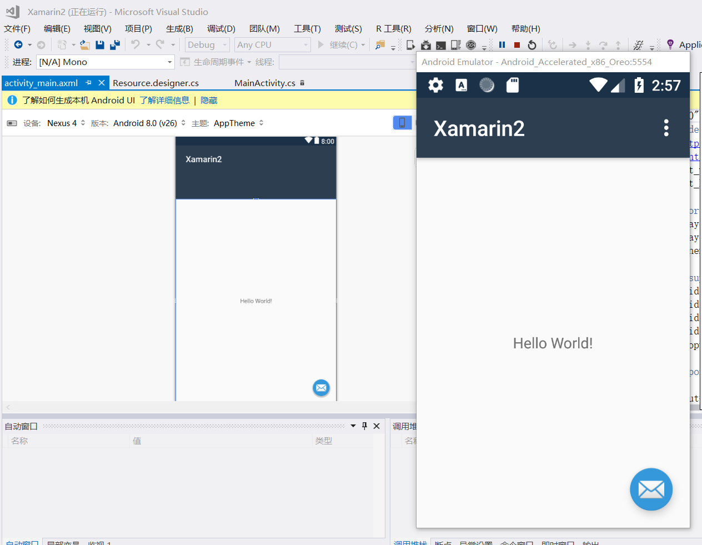
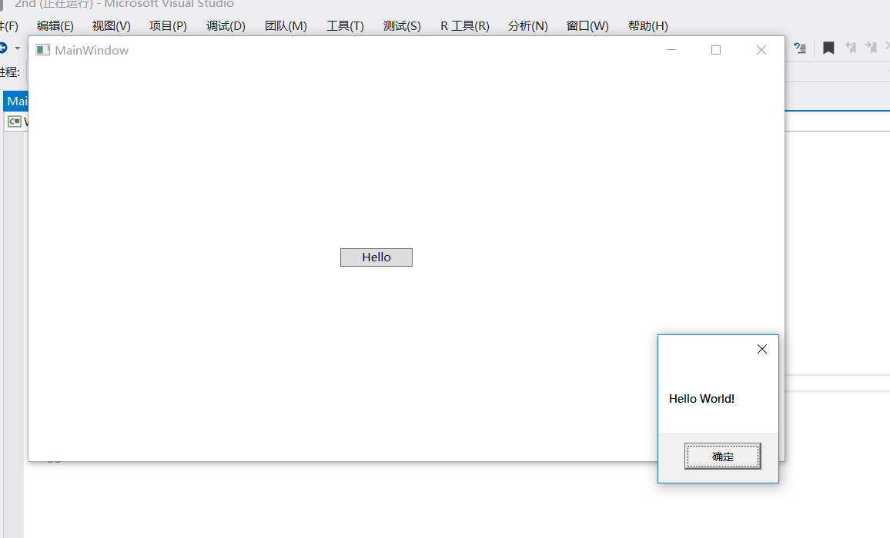
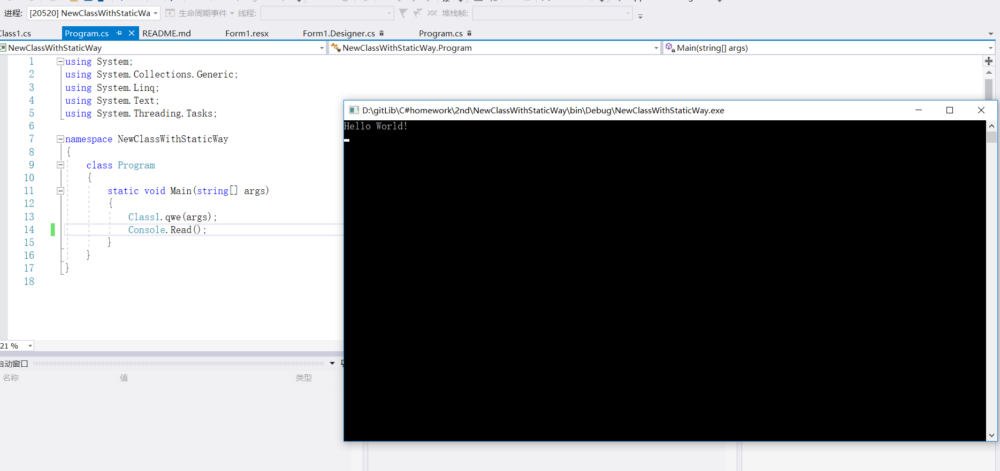
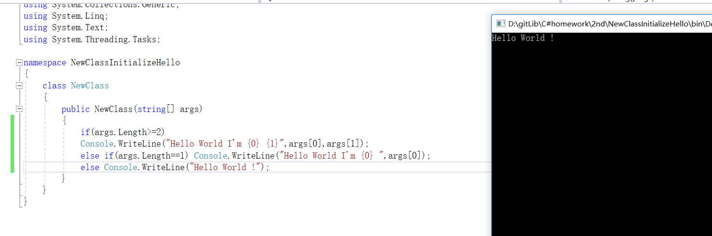

# Csharp2ndHomework
### Android

### Wpf

### Forms

### Static

### NewClass

##### 上完课后回宿舍研究了好一会，终于给wpf和form都加上了从命令行读参的功能

### 问题：

我声明类时，没有声明修饰符，那应该是private，
但我的主函数直接调了里面的public static方法
编译成功还能运行，和课上讲的不要private包public不一样……